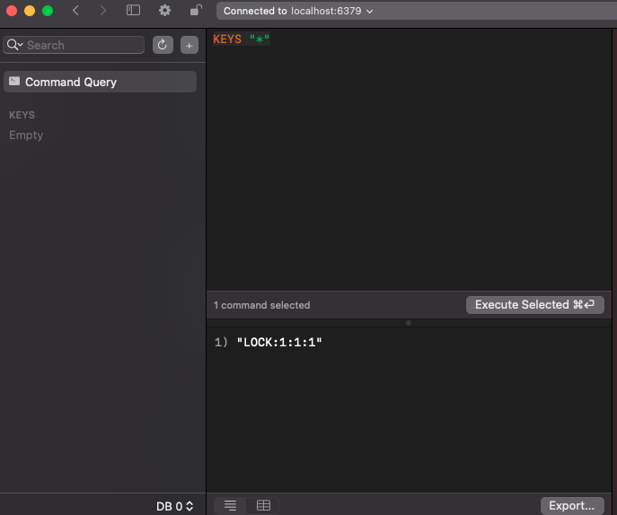
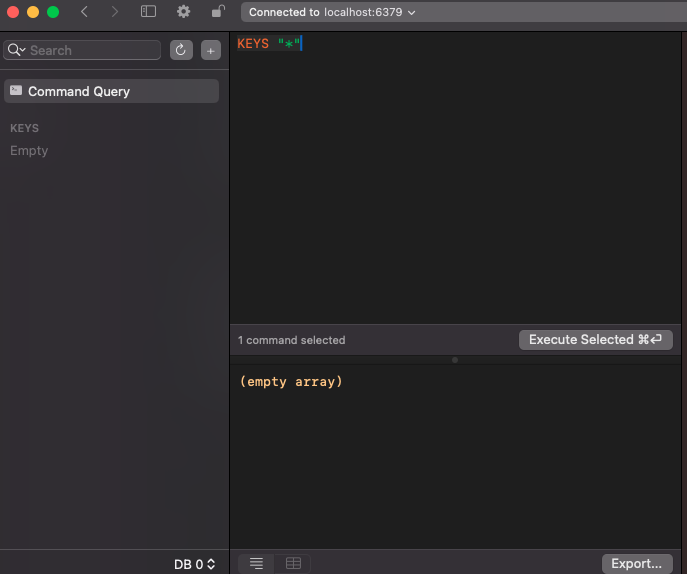
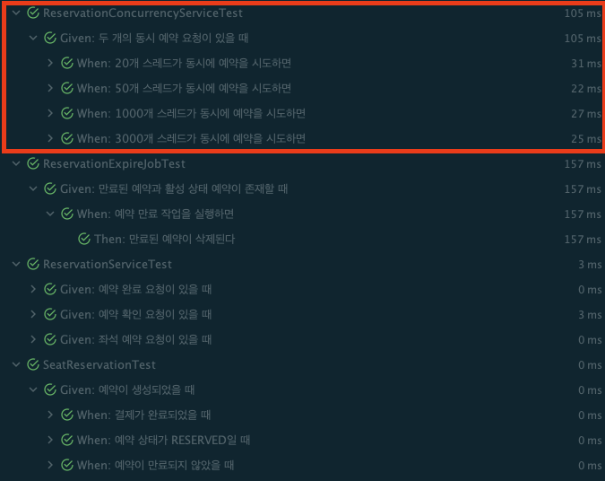

# 동시성 이슈 와 lock 관련 문서

## 1. 개요

동시성 문제로 인해 발생할 수 있는 시스템 불안정성을 해결하기 위한 다양한 제어 방식을 비교하고, 각 방식의 장단점을 분석하여 적합한 선택 기준을 설명합니다.

또한 본 프로젝트에서 동시성 이슈가 발생할 수 있는 시나리오 및 각 시나리오에 대해 어떤 동시성 제어방식을 사용했는지 설명합니다.

---

## 2. 동시성 이슈 정의 및 시나리오

### 동시성 이슈

`동시성 이슈`는 여러 스레드나 프로세스가 `동일한 자원(예: 데이터베이스, 파일, 메모리)에 동시에 접근하여 작업을 수행할 때 발생하는 문제`를 의미합니다.

이러한 상황에서 자원의 일관성(consistency)이나 무결성(integrity)이 훼손될 수 있으며, 결과적으로 서비스 오류나 성능 저하를 초래할 수 있습니다.

크게 아래와 같은 이슈가 발생할 수 있습니다.

- `정합성 문제`: 데이터 일관성 상실.
- `데드락`: 두 프로세스가 서로 자원을 기다리며 멈추는 상황.
- `라이브락`: 스레드가 실행 중이지만 진전이 없는 상태.
- `기아(Starvation)`: 특정 스레드가 자원을 획득하지 못하는 상태.

### 예시 시나리오

위에서 정의한 동시성 이슈 관련 예시 시나리오 입니다.

본 프로젝트에서 동시성 이슈가 발생하는 시나리오는 `5. 프로젝트에서의 적용 방안`에 정의되어있습니다.

1. 은행 계좌 이체
    - A 사용자가 자신의 계좌에서 100만 원을 출금하는 동안, B 사용자가 동시에 동일한 계좌에서 50만 원을 출금하려고 시도.
    - 동시성 제어가 제대로 이루어지지 않으면 계좌 잔고가 음수가 되는 문제가 발생할 수 있음.
2. 재고 관리 시스템
    - 여러 고객이 동시에 특정 상품을 구매하려고 할 때, 재고 수량이 적절히 감소하지 않거나 초과 주문이 발생.
    - 이는 재고 부족 또는 잘못된 재고 정보로 이어질 수 있음.

---

## 3. 동시성 제어 방안

각 동시성 제어 방법에 대해 크게 3가지로 설명하고, 각각의 장점과 단점을 비교합니다.

### 3.1 비관적 락(Pessimistic Locking)

비관적 락은 자원에 접근하려는 트랜잭션이 충돌을 피하기 위해 자원을 잠금 상태로 유지하는 방식입니다. 이 접근 방식에서는 자원이 잠겨 있는 동안 다른 트랜잭션이 동일한 자원에 접근하지 못합니다.

충돌이 발생할 가능성이 높다고 가정하고, 먼저 락을 획득하여 다른 작업의 접근을 제한합니다.

트랜잭션 범위 내에서만 유효합니다.

일반적으로 InnoDB 스토리지 엔진의 트랜잭션에서 사용되며, SELECT … FOR UPDATE 나 LOCK IN SHARE MODE 구문으로 구현.

`LockModeType.PESSIMISTIC_WRITE`을 사용해 쓰기 락을 걸어 다른 트랜잭션이 읽거나 쓰는 것을 방지합니다.

- 예시 : SQL의 `SELECT ... FOR UPDATE` 문은 데이터 조회 시 락을 설정하여 다른 트랜잭션이 동일한 데이터에 접근하거나 변경하지 못하도록 합니다.

```kotlin
import org.springframework.data.jpa.repository.Lock

interface ProductRepository : CrudRepository<Product, Long> {
    @Lock(LockModeType.PESSIMISTIC_WRITE) // 비관적 락 적용
    @Query("SELECT p FROM Product p WHERE p.id = :id")
    fun findByIdWithLock(id: Long): Product?
}

@Service
class ProductService(private val productRepository: ProductRepository) {
    @Transactional
    fun updateProductWithLock(productId: Long, updatedQuantity: Int) {
        val product = productRepository.findByIdWithLock(productId)
            ?: throw IllegalArgumentException("Product not found")
        product.quantity = updatedQuantity
        // 트랜잭션 종료 시 락 해제
    }
}
```

- 장점
    - 정합성 보장: 충돌을 방지하므로 데이터 정합성을 강력하게 유지할 수 있습니다.
    - 단순한 구조: 구현과 사용 방법이 직관적입니다.
- 단점
    - 성능 저하: 트랜잭션이 락을 유지하는 동안 다른 트랜잭션은 대기해야 하므로 시스템 성능이 저하될 수 있습니다.
    - 데드락 발생 위험: 여러 트랜잭션이 서로의 자원을 기다리며 데드락이 발생할 수 있습니다.

### 3.2 낙관적 락(Optimistic Locking)
낙관적 락은 충돌이 드물다고 가정하고, 자원 사용 후 충돌 여부를 검사하여 처리하는 방식입니다. 충돌이 감지되면 롤백하는 방식입니다.

일반적으로 버전 번호나 타임스탬프를 이용하여 데이터 변경 시점을 관리합니다.

- 예시 : JPA에서 @Version 어노테이션을 사용하여 엔티티에 버전 필드를 추가하면, 데이터 업데이트 시 자동으로 버전 검증을 수행합니다.

```kotlin
@Entity
data class Product(
    @Id
    @GeneratedValue(strategy = GenerationType.IDENTITY)
    val id: Long? = null,
    val name: String,
    var quantity: Int,
    @Version // 버전 필드를 사용하여 낙관적 락 적용. 업데이트 시 버전 충돌이 발생하면 예외가 던져집니다.
    val version: Long? = null
)

@Service
class ProductService(private val productRepository: ProductRepository) {
    @Transactional
    fun updateProduct(productId: Long, updatedQuantity: Int) {
        val product = productRepository.findById(productId)
            ?: throw IllegalArgumentException("Product not found")
        product.quantity = updatedQuantity
        productRepository.save(product) // JPA가 자동으로 version 필드를 검사
    }
}
```

- 장점
    - 높은 동시성 처리량: 락을 사용하지 않으므로 자원 경합 없이 높은 동시성을 처리할 수 있습니다.
    - 데드락 없음: 락을 설정하지 않으므로 데드락이 발생하지 않습니다.
- 단점
    - 충돌 발생 시 롤백 필요: 데이터 충돌이 발생하면 작업을 중단하고 롤백해야 합니다.
    - 재시도 로직 구현 필요: 충돌 발생 시 데이터 갱신을 재시도하기 위한 추가 로직이 필요합니다.

### 3.3 분산 락 (Distributed Lock)

분산 락은 여러 노드에서 동일한 자원에 동시 접근을 제어하기 위한 메커니즘입니다. Redis, ZooKeeper, Etcd 등의 도구를 이용해 구현할 수 있습니다.

- 예시 : Redis의 Redisson을 사용하여 특정 키를 기반으로 분산 락을 설정하고, 노드 간의 동기화를 보장합니다.

```kotlin
// redis 사용 예시
@Service
class RedisLockService(private val redisTemplate: StringRedisTemplate) {
    fun acquireLock(lockKey: String, leaseTime: Long): Boolean {
        val result = redisTemplate.opsForValue()
            .setIfAbsent(lockKey, "locked", Duration.ofSeconds(leaseTime))
        return result == true
    }

    fun releaseLock(lockKey: String) {
        redisTemplate.delete(lockKey)
    }
}

@Service
class ProductService(
    private val redisLockService: RedisLockService,
    private val productRepository: ProductRepository
) {
    private val lockKeyPrefix = "lock:product:"

    fun updateProductWithDistributedLock(productId: Long, updatedQuantity: Int) {
        val lockKey = "$lockKeyPrefix$productId"
        // 락 획득
        val acquired = redisLockService.acquireLock(lockKey, leaseTime = 10)

        if (!acquired) {
            throw IllegalStateException("Failed to acquire lock for product $productId")
        }

        try {
            val product = productRepository.findById(productId)
                ?: throw IllegalArgumentException("Product not found")

            product.quantity = updatedQuantity
            productRepository.save(product)
        } finally {
            // 락 해제
            redisLockService.releaseLock(lockKey)
        }
    }
}
```

- 장점
    - 분산 환경에서 정합성 보장: 여러 서버에서 자원 접근을 효과적으로 관리할 수 있습니다.
    - 다양한 구현체 지원: Redis, ZooKeeper 등 다양한 오픈소스 라이브러리를 활용할 수 있습니다.
- 단점
    - 네트워크 지연 및 장애 위험: 네트워크 문제나 서버 장애로 인해 락이 예상대로 해제되지 않을 수 있습니다.
    - 복잡한 구현: 단일 서버의 락보다 구현이 복잡하며, 추가적인 설계와 관리가 필요합니다.


### 3.4 네임드 락(Named Lock)

네임드 락은 데이터베이스에서 제공하는 이름 기반의 락을 사용하여 동시성을 제어하는 방식입니다.

특정 이름(키)을 기준으로 락을 설정하여 동일한 자원에 대한 동시 접근을 차단합니다.

- 예시 : MySQL의 `GET_LOCK`과 `RELEASE_LOCK` 함수를 사용하여 특정 작업에 대한 락을 설정.
```sql
-- 락 획득
SELECT GET_LOCK('lock_name', timeout_seconds);

-- 락 해제
SELECT RELEASE_LOCK('lock_name');
```

```kotlin
import org.springframework.jdbc.core.JdbcTemplate
import org.springframework.stereotype.Service
import org.springframework.transaction.annotation.Transactional

@Service
class NamedLockService(private val jdbcTemplate: JdbcTemplate) {

    @Transactional
    fun executeWithLock(lockName: String, action: () -> Unit) {
        val acquired = jdbcTemplate.queryForObject(
            "SELECT GET_LOCK(?, 10)", Boolean::class.java, lockName
        )

        if (acquired == true) {
            try {
                action()
            } finally {
                jdbcTemplate.update("SELECT RELEASE_LOCK(?)", lockName)
            }
        } else {
            throw IllegalStateException("Failed to acquire lock: $lockName")
        }
    }
}

@Service
class BusinessService(private val namedLockService: NamedLockService) {
    fun updateSharedResource() {
        namedLockService.executeWithLock("shared_resource_lock") {
            // 공유 자원 업데이트 로직
        }
    }
}
```

---

## 4.동시성 제어 방식 비교
동시성을 제어하는 각 방식의 주요 특징, 장점, 단점을 비교합니다.

| 방식                 | 주요 특징               | 장점                 | 단점               | 사용 사례       |
|--------------------|---------------------|--------------------|------------------|-------------|
| 비관적 락              | 자원에 대한 락을 즉시 획득     | 정합성 보장, 간단한 구조     | 성능 저하, 데드락 위험    | 재고 관리 시스템   |
| 낙관적 락              | 충돌 검사를 통해 동시성 제어    | 높은 동시성 처리량, 데드락 없음 | 충돌 발생 시 롤백 필요    | 전자상거래       |
| 분산 락               | 분산 환경에서 자원 접근 동기화   | 분산 환경에서 정합성 보장     | 네트워크 지연, 복잡한 구현  | 분산 캐시, 분산 큐 |
| 네임드 락 (Named Lock) | 특정 이름(키)을 기준으로 락 설정 | 간단한 구현, 정합성 보장     | DB 부하 증가, 확장성 제한 | 트랜잭션 동기화    |

---

### 5. 프로젝트에서의 적용 방안
우선 프로젝트에서 동시성 이슈가 적용될 각 시나리오별 적용할 동시성 제어 방식에 대해 설명합니다.

1. **좌석 예약**
    - 적용방식 : **분산락** + 비관적 락
    - 이유 : 좌석 예약 시스템의 경우, 높은 동시성이 예상되는 도메인으로 다수의 인스턴스가 동시에 예약 요청을 처리할 수 있습니다. 단 하나의 좌석만 존재하는 상황에서, 낙관적 락을 적용하면, 한 개의 요청만 성공하고 나머지 요청은 빠르게 실패하며, 사용자에게 즉시 실패를 알려줄 수 있습니다. 이로써 `빠른 실패(fast failure)`를 통해 사용자는 좌석을 선택하고 예약을 진행하는 흐름을 효율적으로 이어갈 수 있습니다.  하지만, 데이터베이스의 부하가 커질 가능성도 있기 때문에, 분산 락을 적용하여 각 인스턴스에서 동시 접근 시 발생할 수 있는 충돌을 방지하고, 보다 안정적인 좌석 예약 처리를 할 수 있도록 합니다. 분산 락을 사용하면 여러 인스턴스가 동일한 좌석을 예약하려는 시도를 효율적으로 관리하면서도, 일관된 예약 상태를 유지할 수 있습니다. 또한, redis의 HA 구성이 된다면 redis master-slave간 데이터 복제시 latency로 인해 일관된 동작을 할 수 없다는 가능성이 있기에 DB 접근시 2차 방어로써 비관적락을 적용하였습니다.

2. **잔액 충전**
    - 적용방식 : **비관적 락**
    - 이유 : 잔액 충전은 시스템의 중요한 작업이며, 충전 중에 다른 작업(예: 결제)이 동시에 발생하면 문제가 발생할 수 있습니다. 이 경우, **비관적 락(Pessimistic Locking)**을 사용하여 잔액이 충전되는 동안 다른 작업이 동시에 진행되지 않도록 하였습니다. 예를 들어, 사용자의 잔액 정보를 잠그고 충전이 완료될 때까지 다른 트랜잭션이 해당 정보를 수정할 수 없게 합니다. 그리고 분산 시스템에서는 분산 락을 사용하여 여러 인스턴스에서 동시에 결제 작업을 처리하지 않도록 할 수는 있지만, 여러벌의 서비스가 필요한 도메인이 아니라고 판단해 비관적 락을 사용하였습니다.

---

### 6. 락 획득 시나리오
동시성 제어를 위해 반드시 공유자원에 접근하는 작업은 공유자원에 락을 먼저 점유후 작업을 진행해야합니다.

또한 원자성을 보장하면서 동시성 제어를 하기 위해 `락 획득 -> 트랜잭션 시작 -> 비즈니스 로직 -> 트랜잭션 종료(커밋 or 롤백) -> 락 반납` 순으로 진행하였습니다.

---

### 7. 프로젝트 적용
5, 6에서 설명한 동시성 이슈 시나리오에 대해서 적절한 해결 방안을 적용하였습니다.

1. **좌석 예약**
- 1차로 Redis 분산 락 동시성 제어를 수행합니다.
- 2차로 비관적 락을 통해 데이터 정합성을 보장합니다.
- AOP, redisson를 적극 활용하여 구현하였습니다.

- aop 코드

위와같이 정의한다면 `락 획득 -> 트랜잭션 시작 -> 비즈니스 로직 -> 트랜잭션 종료(커밋 or 롤백) -> 락 반납`의 절차를 지킬 수 있으며, 손쉽게 분산락을 적용하기 쉽게 구현하였습니다.

- 콘서트 예약 usecase 입니다. annotation으로 lock key를 지정합니다. 
- 2차로 비관적 락을 걸어 데이터 정합성을 보장합니다. 
```kotlin
@DistributedLockWithTransactional(key = "#command.concertId + ':' + #command.scheduleId + ':' + #command.seatNo")
fun createReservationInfo(command: CreateReserveSeatCommand): CreateReservedSeatInfo {
    // 좌석 예약 유무 확인
    val reservedSeat =
        reservationRepository.findReservedSeatWithLock(command.seatNo, command.scheduleId)
            ?.let { throw AlreadyReservedException(command.seatNo) }

    // 비관적 락
    val seat =
        concertRepository.getSeatForReservationWithLock(ReserveSeatCommand(command.scheduleId, command.seatNo))
            ?: throw SeatNotFoundException()

    val seatReservation =
        SeatReservation(
            user = command.user,
            seat = seat,
            paymentId = null,
        )

    val savedReservation = reservationRepository.createReservation(seatReservation)

    return savedReservation.toCreateReservedSeatInfo(seat.no)
}
```

- 아래와 같이 락을 획득하고 해제하는 과정을 aop로 구성합니다.
- 또한 lock을 획득하고 트랜잭션 AOP를 호출하여 `락획득 -> 트랜잭션 시작`의 순서를 보장합니다.
```kotlin
@Around("@annotation(io.hhplus.concertreservationservice.infrastructure.lock.DistributedLockWithTransactional)")
@Throws(Throwable::class)
fun lock(joinPoint: ProceedingJoinPoint): Any? {

    // ... 락 획득 시도
    val rLock: RLock = redissonClient.getLock(key)

    return try {
        val available =
            rLock.tryLock(
                distributedLockWithTransactional.waitTime,
                distributedLockWithTransactional.leaseTime,
                distributedLockWithTransactional.timeUnit,
            )
        if (!available) {
            return false
        }
            
        // 트랜잭션 start
        aopForTransaction.proceed(joinPoint)
    } catch (e: InterruptedException) {
        throw InterruptedException()
    } finally {
        try {
            // 락 해제
            if (rLock.isHeldByCurrentThread) {
                rLock.unlock()
            }
        } catch (e: IllegalMonitorStateException) {
            log.info(
                "Redisson Lock Already Unlocked: serviceName = {}, key = {}",
                method.name,
                key,
            )
        }
    }
}
```

- 트랜잭션 AOP
```kotlin
@Component
class AopForTransaction {
    @Transactional(propagation = Propagation.REQUIRES_NEW)
    @Throws(Throwable::class)
    fun proceed(joinPoint: ProceedingJoinPoint): Any? {
        return joinPoint.proceed()
    }
}
```
-  비관적 락 또한 설정해주었습니다.
```kotlin
@Lock(LockModeType.PESSIMISTIC_WRITE)
@Query(
    """
    SELECT s 
    FROM Seat s
    JOIN s.scheduleSeat ss
    WHERE s.no = :seatNo
      AND ss.schedule.id = :scheduleId
    """
)
fun findByNoAndScheduleSeat_Schedule_Id(seatNo: Int, scheduleId: Long): Seat?
```

- redis의 락 획득이 되면 아래와 같이 `key:value`가 세팅됩니다.

- redis의 락 획득이 되면 아래와 같이 값이 사라집니다.



2. **잔액 충전**
- 충전할 유저 레코드에 비관적 락을 걸고 충전을 진행하였습니다.

```kotlin
@Lock(LockModeType.PESSIMISTIC_WRITE)
@Query("SELECT u FROM User u WHERE u.id = :id")
fun findByIdWithLock(id: Long): User?
```

```kotlin
@Transactional
fun chargeBalance(command: ChargeBalanceCommand): ChargedBalanceInfo {
    val user = userRepository.getUserByIdWithLock(command.userId) ?: throw UserNotFoundException(command.userId)

    user.chargeMoney(command.money)
    val savedUser = userRepository.save(user)
    return ChargedBalanceInfo(
        savedUser.id,
        savedUser.name,
        savedUser.balance,
    )
}
```

### 8. 성능
기본적인 성능 측정은 connection pool default 10개, threadCount 10개로 진행하였습니다.

비관적 락만 사용할때와 분산락을 적용하였을때의 테스트 실행시간을 비교하였습니다. 그리고 20개, 50개, 1000개, 3000개 의 요청을 늘려가면서 테스트 해본 결과입니다.

> 빨간 네모의 given절은 오타이므로 무시해주세요..
- 비관적 락만 사용
```kotlin
@Transactional
fun createReservationInfo(command: CreateReserveSeatCommand): CreateReservedSeatInfo {
    // ...
}
```


- 분산락 적용
```kotlin
@distributedLockWithTransactional(key = "#command.concertId + ':' + #command.scheduleId + ':' + #command.seatNo")
fun createReservationInfo(command: CreateReserveSeatCommand): CreateReservedSeatInfo {
    // ...
}
```



빨간 네모를 친 부분외에도 전체적으로 분산락을 적용 후 테스트에 소요되는 시간 자체가 약간 늘어난 것을 확인할 수 있습니다.

그 이유를 생각해보면 redis에 lock을 획득/해제 하는 과정에서 네트워크 latency의 영향이라고 생각합니다.

그러나 일정 요청량 이상이 넘어가면 DB에서 락 제어를 하기 위함보다 redis의 분산락을 사용할때 성능이 더 좋다는 것을 확인하였습니다.


### 9. 결론

반드시 분산락이 좋다, DB에서 제어하는 낙관락, 비관락, 네임드락이 좋다고 단정지을 순 없습니다.

